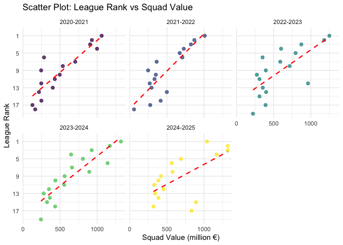
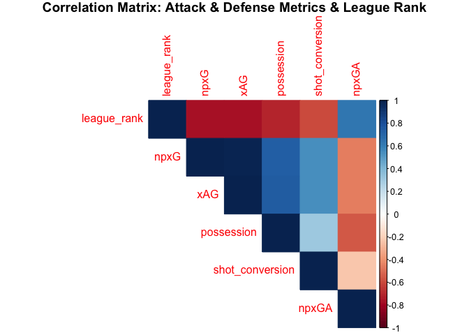

# 1. Introduction
One of the most interesting questions in modern sport is, what is the key driver of success in soccer: **financial power** or **in-game performance**? This project applies data science tools to answer this question with data collected from the English Premier League over the last five seasons. Specifically, we investigate:

1. The relationship between **a club's financial power (squad market value and wage bill)** and **its sporting success (final league position)** in the English Premier League over the last five seasons.

2. The connection of **in-game statistics and match events (e.g., possession, expected goals (xG))** with **a final league position in the English Premier League**.

The following report details our process, from **data collection** via sources like Transfermarkt and FBref, through **rigorous cleaning** and **preparation**, to a **comprehensive statistical and visual analysis** that provides transparent, data-driven insights into the dynamics of success in the world's most-watched league.

# 2. Data Collection
This section describes **the process of collecting Premier League club financial data** from Transfermarkt and **downloading in-game statistics** from FBref as csv files.

## 2.1. Web Scrape Financial Data
We create a **web scraping** function called `scrape_transfermarkt_season` to extract club team market values from Transfermarkt. The function loads the page using Transfermarkt's standard URL format and extracts HTML tables for each season. This approach automatically collects the team values of all Premier League clubs as of August 15 for the last five seasons.


``` r
library(tidyverse)
library(dslabs)
library(tidyverse)
library(ggplot2)
library(ggthemes)
library(RColorBrewer)
library(rvest)
library(readxl)
library(readr)
library(janitor)
library(gt)
library(knitr)
```


``` r
# Web scraping code for Transfermarkt

# Function to scrape Transfermarkt for any season 

scrape_transfermarkt_season <- function(year)  {
  # Generate page url for season using transfermarkt pattern
  # Transfermarkt url pattern: /stichtag/YYYY-MM-DD/
  # Squad Values taken at season start (August 15)
  url <- paste0("https://www.transfermarkt.com/premier-league/marktwerteverein/wettbewerb/GB1/stichtag/", year, "-08-15/plus/1")
  
  # Read and scrape page with handling errors
  page <- tryCatch({read_html(url)}, error = function(e){
    cat("Error loading page for", year, ":", e$message, "\n")
    return(NULL)
  })
  if(is.null(page)) {
    return(NULL)
  }
  
  # Scrape table from a page
  tab <- page |> html_nodes("table.items") |> html_table(fill = TRUE)
  if(is.null(tab)) {
    return(NULL)
  }
  
  # Return the table data
  return(tab[[1]])
}
scrape_transfermarkt_season(2025)
```

```
## # A tibble: 21 × 13
##      `#` wappen Club                   Club  League as at15/08/20…¹
##    <int> <lgl>  <chr>                  <chr> <chr>                 
##  1    NA NA     Total value of all cl… Tota… Total value of all cl…
##  2     1 NA     Manchester City        Prem… €1.32bn               
##  3     2 NA     Arsenal FC             Prem… €1.32bn               
##  4     3 NA     Chelsea FC             Prem… €1.17bn               
##  5     4 NA     Liverpool FC           Prem… €1.04bn               
##  6     5 NA     Tottenham Hotspur      Prem… €832.10m              
##  7     6 NA     Manchester United      Prem… €892.20m              
##  8     7 NA     Newcastle United       Prem… €689.90m              
##  9     8 NA     Nottingham Forest      Prem… €446.00m              
## 10     9 NA     Crystal Palace         Prem… €456.20m              
## # ℹ 11 more rows
## # ℹ abbreviated name: ¹​`League as at15/08/2025`
## # ℹ 8 more variables: `Value 15/08/2025` <chr>,
## #   `Squad size 15/08/2025` <chr>, `Current value` <chr>,
## #   `Current  squad size` <chr>, Difference <chr>, `%` <int>,
## #   `` <chr>, `` <chr>
```

## 2.2. Extraction of Performance Data
In this part, we illustrate **the process of extracting in-field statistics** (such as expected goals (per 90 mins), xG, possession, etc.) of Premier League clubs, which is downloaded as a csv file from the **FBref** website. The function reads the CSV files stored in the `CSV/` folder for the last 5 seasons, stores each season’s data in the `all_seasons_performance_metrics` list, and finally combines them in a single data frame by using the `bind_rows` function. Together with the web scrape of financial data in 2.1, we collected and loaded all necessary data.


``` r
# Function to extract performance metrics from pre-downloaded FBref CSV files
extract_performace_metrics <- function() {
  # We focus on last 5 seasons
  seasons <- 2021:2025
  
  # Initialize empty list to store each season's data
  all_seasons_performance_metrics <- list()
  
  for(season in seasons) {
    # Construct file path for the season's CSV
    # File naming pattern: "2020-21.txt", "2021-22.txt", etc.
    url <- paste0("CSV/", paste0(season - 1, "-", season), ".txt")
    #  Read the CSV file containing performance statistics
    tab_season <- read_csv(url)
    # Store in list with season as key 
    all_seasons_performance_metrics[[as.character(season)]] <- tab_season
  }
  # Combine all seasons into one dataframe
  all_seasons_performance_metrics <- bind_rows(all_seasons_performance_metrics)
  return(all_seasons_performance_metrics)
}
# Execute the function
extract_performace_metrics()
```

```
## # A tibble: 100 × 41
##       Rk Season    Team  Comp  xG...5    MP     W     D     L   Pts
##    <dbl> <chr>     <chr> <chr>  <dbl> <dbl> <dbl> <dbl> <dbl> <dbl>
##  1     1 2020-2021 Shef… eng …   32.6    38     7     2    29    23
##  2     2 2020-2021 Crys… eng …   34.1    38    12     8    18    44
##  3     3 2020-2021 West… eng …   35.8    38     5    11    22    26
##  4     4 2020-2021 Wolv… eng …   36.5    38    12     9    17    45
##  5     5 2020-2021 Burn… eng …   39.3    38    10     9    19    39
##  6     6 2020-2021 Fulh… eng …   40.5    38     5    13    20    28
##  7     7 2020-2021 Sout… eng …   41.2    38    12     7    19    43
##  8     8 2020-2021 Newc… eng …   43.4    38    12     9    17    45
##  9     9 2020-2021 Ever… eng …   45.7    38    17     8    13    59
## 10    10 2020-2021 Brig… eng …   50.9    38     9    14    15    41
## # ℹ 90 more rows
## # ℹ 31 more variables: `Pts/MP` <dbl>, Min <dbl>, Subs <dbl>,
## #   LgRank <dbl>, GF <dbl>, GA <dbl>, GD <dbl>, Poss <dbl>,
## #   CS <dbl>, `CS%` <dbl>, `G-PK` <dbl>, PK <dbl>, PKatt <dbl>,
## #   PKm <dbl>, xG...25 <dbl>, npxG <dbl>, xGD <dbl>, npxGD <dbl>,
## #   xAG <dbl>, xA <dbl>, `G-xG` <dbl>, `np:G-xG` <dbl>,
## #   `A-xAG` <dbl>, `npxG/Sh` <dbl>, Sh <dbl>, `G/Sh` <dbl>, …
```

# 3. Data Cleaning
In this section, we are **cleaning the collected data** from a previous section. 

## 3.1. Individual Season Cleaning (Transfermarkt)
For processing raw Transfermarkt data for a single season, we construct a function called `clean_transfermarkt_table`. The function does numerous adjustments:  

1. **First cleanup**: removes empty rows and columns.  
2. **Improvement of structure**: removes unused columns and headers row  
3. **Added data**: adds a season identifier and gives columns names that are meaningful.
4. **Data selection**: keeps only relevant variables for analysis
5. **Type conversion**: transforms text data to proper numeric formats


``` r
# Transfermarkt data cleaning

# Function to clean the scraped table from Transfermarkt
clean_transfermarkt_table <- function(tab, year) {
  
  # 1. Initial cleanup: remove empty rows/columns  
  cleaned_tab <- remove_empty(tab) 
  
  # 2. Structure refinement: remove headers and irrelevant columns
  total_rows <- nrow(cleaned_tab)
  total_cols <- ncol(cleaned_tab)
  cleaned_tab <- cleaned_tab[(2 : total_rows), (1 : (total_cols - 3))]

  # 3. Metadata addition: assign column names and season identifier
  cleaned_tab <- setNames(cleaned_tab, c("rank", "club", "league", "squad_value", "squad_size", "current_squad_value", "current_squad_size", "difference", "difference_percentage"))
  
  season_label <- paste0(year - 1, "-", year)
  cleaned_tab$season <- season_label
  
  # Extract club, squad_value, squad_size, ans season fields
  
  # 4. Data selection: keep only essential variables
  cleaned_tab <- cleaned_tab |> select(c(club, squad_value, squad_size, season))
  
  # 5. Type conversion: clean and convert to proper formats
  cleaned_tab <- cleaned_tab |> filter(!is.na(club)) |> mutate( squad_value = case_when(str_detect(squad_value, "bn") ~ as.numeric(str_replace_all(squad_value, "[€,b,n]", "")) * 1000,
  str_detect(squad_value, "m") ~ as.numeric(str_replace_all(squad_value, "[€,m]", "")),
  TRUE ~ NA), squad_size = as.numeric(squad_size))
  
  # Return cleaned table for a season
  return(cleaned_tab)
}
clean_transfermarkt_table(scrape_transfermarkt_season(2025), 2025)
```

```
## # A tibble: 20 × 4
##    club                    squad_value squad_size season   
##    <chr>                         <dbl>      <dbl> <chr>    
##  1 Manchester City               1320          34 2024-2025
##  2 Arsenal FC                    1320          28 2024-2025
##  3 Chelsea FC                    1170          36 2024-2025
##  4 Liverpool FC                  1040          28 2024-2025
##  5 Tottenham Hotspur              832.         30 2024-2025
##  6 Manchester United              892.         32 2024-2025
##  7 Newcastle United               690.         26 2024-2025
##  8 Nottingham Forest              446          28 2024-2025
##  9 Crystal Palace                 456.         30 2024-2025
## 10 Aston Villa                    565          26 2024-2025
## 11 Brighton & Hove Albion         577.         34 2024-2025
## 12 AFC Bournemouth                420.         30 2024-2025
## 13 Brentford FC                   387.         32 2024-2025
## 14 Everton FC                     340.         23 2024-2025
## 15 Fulham FC                      332.         23 2024-2025
## 16 West Ham United                387.         29 2024-2025
## 17 Sunderland AFC                 251.         41 2024-2025
## 18 Leeds United                   272.         28 2024-2025
## 19 Wolverhampton Wanderers        319          28 2024-2025
## 20 Burnley FC                     236.         39 2024-2025
```
As we want to handle clubs' squad values in million euros, we multiply billion values by 1000 and keep million values untouched. All teams in Premier League worth millions, so we do not handle thousand values.

## 3.2. Execute Data Combination (Transfermarkt)
The `combine_for_last_5_seasons()` function unites cleaned financial data across all five seasons into a single dataset. It iterates through the 2021-2025 seasons, scrapes and cleans each season's data by using our previously defined functions, and stores them in a list. Finally, it vertically combines all seasonal datasets using `bind_rows()`, creating a tidy data frame where each row represents one club in one specific season. This integrated dataset forms the complete foundation for our financial analysis of the Premier League.

``` r
combine_for_last_5_seasons <- function() {
  # We focus on last 5 seasons
  seasons <- 2021:2025
  
  # Create an empty list to store each season's data
  all_seasons_list <- list()
  
  for(season in seasons) {
    # Scrape and clean data for this season
    season_data <- clean_transfermarkt_table(scrape_transfermarkt_season(season), season)
    
    # Add to list
    all_seasons_list[[as.character(season)]] <- season_data
  }
  
  # Combine vertically (stack rows)
  combined_data <- bind_rows(all_seasons_list)
  
  return(combined_data)
}

  transfermarkt_data <- combine_for_last_5_seasons()
  transfermarkt_data
```

```
## # A tibble: 100 × 4
##    club              squad_value squad_size season   
##    <chr>                   <dbl>      <dbl> <chr>    
##  1 Manchester City        1060           25 2020-2021
##  2 Arsenal FC              537           27 2020-2021
##  3 Chelsea FC              998           37 2020-2021
##  4 Liverpool FC            904.          32 2020-2021
##  5 Tottenham Hotspur       704           26 2020-2021
##  6 Manchester United       928.          30 2020-2021
##  7 Newcastle United        246.          26 2020-2021
##  8 Nottingham Forest        38.8         24 2020-2021
##  9 Crystal Palace          215.          24 2020-2021
## 10 Aston Villa             429.          25 2020-2021
## # ℹ 90 more rows
```
## 3.3. Performance Data Cleaning (FBref)
Cleaning of performance data, such as selecting key variables and standardizing club names to be the same as Transfermarkt data, is done in this part. Our particular function named `clean_performance_metrics()` initially acquires raw in-field statistics by calling the `extract_performace_metrics()` function, then selects the more appropriate factors, including expected goals without penalties (`npxG`), expected goals difference (`npxGD`), expected assisted goals (`xAG`), possession, and goals per shot (`shot_conversion`), for the analysis. To evaluate the defense performance, the expected no penalty goals against `npxGA` are calculated based on `npxG` and `npxGD`, then added to the data frame. Essentially, we standardize club names, which is the key step to successfully combine both data frames in the next section.


``` r
# Function to clean and select key performance metrics
clean_performace_metrics <- function() {
  
  performance_metrics <- extract_performace_metrics()
  # Select and rename key performance indicators
  performance_metrics <- select(performance_metrics, season = Season, club = Team, league_rank = LgRank, npxG, npxGD, xAG, possession = Poss, shot_conversion = `G/Sh`)
  
  # Calculate expected goals against (defensive performance)
  # npxGA = npxG - npxGD  (Expected goals against = Expected goals - Expected goals difference)
  performance_metrics$npxGA <- performance_metrics$npxG - performance_metrics$npxGD
  
  # Standardize club names to match Transfermarkt data
  performance_metrics <- performance_metrics |> mutate(club = case_when(str_detect(club, regex("man city|mancity|manchester city", ignore_case = TRUE)) ~ "Manchester City", str_detect(club, regex("man utd|man united|manchester utd|manchester united", ignore_case = TRUE)) ~ "Manchester United", str_detect(club, regex("arsenal", ignore_case = TRUE)) ~ "Arsenal FC", str_detect(club, regex("chelsea", ignore_case = TRUE)) ~ "Chelsea FC", str_detect(club, regex("tottenham|spurs", ignore_case = TRUE)) ~ "Tottenham Hotspur", str_detect(club, regex("west ham", ignore_case = TRUE)) ~ "West Ham United", str_detect(club, regex("crystal palace|palace", ignore_case = TRUE)) ~ "Crystal Palace", str_detect(club, regex("fulham", ignore_case = TRUE)) ~ "Fulham FC", str_detect(club, regex("brentford", ignore_case = TRUE)) ~ "Brentford FC", str_detect(club, regex("liverpool", ignore_case = TRUE)) ~ "Liverpool FC", str_detect(club, regex("everton", ignore_case = TRUE)) ~ "Everton FC", str_detect(club, regex("aston villa|villa", ignore_case = TRUE)) ~ "Aston Villa", str_detect(club, regex("wolves|wolverhampton", ignore_case = TRUE)) ~ "Wolverhampton Wanderers", str_detect(club, regex("leicester", ignore_case = TRUE)) ~ "Leicester City", str_detect(club, regex("nottingham forest|nottm forest", ignore_case = TRUE)) ~ "Nottingham Forest", str_detect(club, regex("newcastle", ignore_case = TRUE)) ~ "Newcastle United", str_detect(club, regex("sunderland", ignore_case = TRUE)) ~ "Sunderland AFC", str_detect(club, regex("southampton|soton", ignore_case = TRUE)) ~ "Southampton", str_detect(club, regex("bournemouth", ignore_case = TRUE)) ~ "AFC Bournemouth", str_detect(club, regex("brighton", ignore_case = TRUE)) ~ "Brighton & Hove Albion", str_detect(club, regex("leeds", ignore_case = TRUE)) ~ "Leeds United", str_detect(club, regex("burnley", ignore_case = TRUE)) ~ "Burnley FC", str_detect(club, regex("watford", ignore_case = TRUE)) ~ "Watford", str_detect(club, regex("norwich", ignore_case = TRUE)) ~ "Norwich City", str_detect(club, regex("sheffield utd|sheffield united", ignore_case = TRUE)) ~ "Sheffield United", TRUE ~ club))

  return(performance_metrics)
}
# Execute the function
fbref_data <- clean_performace_metrics()
fbref_data
```

```
## # A tibble: 100 × 9
##    season    club          league_rank  npxG npxGD   xAG possession
##    <chr>     <chr>               <dbl> <dbl> <dbl> <dbl>      <dbl>
##  1 2020-2021 Sheffield Un…          20  29.5 -29.6  24.9       41.7
##  2 2020-2021 Crystal Pala…          14  31   -24.1  23.6       40.6
##  3 2020-2021 West Brom              19  32.7 -26.6  24.4       37.9
##  4 2020-2021 Wolverhampto…          13  33.4  -9.8  24.1       49.3
##  5 2020-2021 Burnley FC             17  36.9 -15.4  27.7       42.1
##  6 2020-2021 Fulham FC              18  35.9 -11.2  26.3       49.7
##  7 2020-2021 Southampton            15  36.6  -9.5  25.8       52  
##  8 2020-2021 Newcastle Un…          12  37.8 -16.6  29         38.8
##  9 2020-2021 Everton FC             10  41.9  -5    30.7       46.4
## 10 2020-2021 Brighton & H…          16  43.8  14    33.2       51.1
## # ℹ 90 more rows
## # ℹ 2 more variables: shot_conversion <dbl>, npxGA <dbl>
```

## 3.4. Merge Financial and Performance Data
In the last step of data cleaning, financial data, which involves Premier League clubs' squad values and squad sizes across seasons, scraped from Transfermarkt, and in-field metrics from FBref are united in a single data frame. The `combine_transfermarkt_fbref()` function achieves it by using `inner_join()`, ensuring that we work on rows existing in both datasets. Following that, the function converts the type of season column from character into a chronologically ordered factor, which is an essential amendment to plot the seasonal trends. Finally, our united dataset called `data` will be used for the analysis part.


``` r
# Function to combine both financial(squad value) and performance(expected goals, ...) data
combine_transfermarkt_fbref <- function() {
  # Merge financial and performance data
    premier_league_data <- inner_join(transfermarkt_data, fbref_data, by = c("club", "season")) # CRITICAL: Join by both fields
  
  # Convert season to ordered factor (chronological order)
    premier_league_data <- premier_league_data |> mutate(season = factor(season, levels = c("2020-2021", "2021-2022", "2022-2023", "2023-2024", "2024-2025"), ordered = TRUE))
    
    
  return(premier_league_data)
}

# Execute the function
data <- combine_transfermarkt_fbref()
data
```

```
## # A tibble: 82 × 11
##    club       squad_value squad_size season league_rank  npxG npxGD
##    <chr>            <dbl>      <dbl> <ord>        <dbl> <dbl> <dbl>
##  1 Mancheste…       1060          25 2020-…           1  61.2  38.9
##  2 Arsenal FC        537          27 2020-…           8  47     6.4
##  3 Chelsea FC        998          37 2020-…           4  54.5  27.4
##  4 Liverpool…        904.         32 2020-…           3  62.9  26  
##  5 Tottenham…        704          26 2020-…           7  49.2   7.9
##  6 Mancheste…        928.         30 2020-…           2  51.4  13.1
##  7 Newcastle…        246.         26 2020-…          12  37.8 -16.6
##  8 Crystal P…        215.         24 2020-…          14  31   -24.1
##  9 Aston Vil…        429.         25 2020-…          11  47.9   1.5
## 10 Brighton …        248.         30 2020-…          16  43.8  14  
## # ℹ 72 more rows
## # ℹ 4 more variables: xAG <dbl>, possession <dbl>,
## #   shot_conversion <dbl>, npxGA <dbl>
```


# 4. Analysis for Question 1

## 4.1 Scatter Plot: League Rank vs Squad Value
The **scatter plot** demonstrates the relationship between a club's financial power, measured by squad value, and its competitive success, measured by final league position, across 5 seasons. It is obvious that there is a **negative correlation: higher squad values are strongly associated with lower league ranks**. For example, clubs positioned in the top 5 of the league typically have squad values exceeding approximately €600 million, while those ranking ninth or below are mostly grouped below €500 million. In addition, the red dashed linear line reinforces this observation that more investment in players increases the competition and the team's potential for success in the league. 


``` r
# Scatter Plot
data |> ggplot(aes(x = squad_value, y = league_rank, color = season)) + geom_point(size = 2, alpha = 0.75) + geom_smooth(method = "lm", se = FALSE, color = "red", linetype = "dashed", linewidth = 0.8) + facet_wrap(~season, nrow = 2) + labs (title = "Scatter Plot: League Rank vs Squad Value", y = "League Rank", x = "Squad Value (million €)") + scale_y_reverse(breaks = seq(1, 20, by = 4)) + theme_minimal() + theme(legend.position = "none")
```

<!-- -->

## 4.2 Linear Regression Model: Calculation of Correlation


``` r
# Apply linear regression model
model <- lm(league_rank ~ squad_value, data = data)

# Extract key insights from model
r_squared <- summary(model)$r.squared
p_value <- summary(model)$coefficients[2, 4]
slope <- coef(model)["squad_value"]

cat("Linear Regression Results:\n",
  "-------------------------\n",
  "R-squared: ", round(r_squared, 3), "\n",
  "P-value: ", ifelse(p_value < 0.001, "< 0.001", "> 0.001"), "\n", "Slope (Coefficient): ", round(slope, 4), "\n") 
```

```
## Linear Regression Results:
##  -------------------------
##  R-squared:  0.586 
##  P-value:  < 0.001 
##  Slope (Coefficient):  -0.0122
```

**Interpretation:** The **r-squared value** is `0.586`, which means that `58.6%` of clubs having different league ranks is associated with their squad values. Most importantly, a **p-value < 0.001** reveals a highly significant negative correlation between squad value and league rank. Also, **slope** helps us predict the improvement in league rank for every increase in the squad value. For instance, when squad value increases by `€1 million`, then rank improves by `0.0122` positions. For `1` position improvement, squad value must increase by  `1 / 0.0122 ≈ €82 million`.

# 5. Analysis for Question 2
To visualize the correlation between Premier League clubs' league ranks and in-pitch statistics, a **correlation matrix** is used. The correlation matrix reveals that both `npxG` (expected goals without penalties, r = `-0.7684164`) and `xAG` (expected assisted goals, r = `-0.7677398`), which determine the quality of attacks, are strongly correlated with league rank. This leads us to think that chance creation to score is the primary driver of top league positions. It is surprising that possession (r = `-0.7012525`) has more positive impacts on league rank than defensive strength (r = `0.6365615`). This finding challenges the conventional wisdom that better defense is key to winning a league title. Among all of these metrics, shot conversion (r = `-0.5953237`) has the least correlation with league rank, although it is still moderately important. 
As a result, these findings suggest that chance creation and ball control are better predictors of success than defense.


``` r
# Create a correlation matrix
cor_matrix <- data |> select(league_rank, npxG, xAG, possession, shot_conversion, npxGA) |> cor(use = "complete.obs")

# Plot correlation matrix
corrplot::corrplot(cor_matrix, method = "color", type = "upper", title = "Correlation Matrix: Attack & Defense Metrics & League Rank", mar = c(0, 0, 1, 0))
```

<!-- -->

``` r
cat("Correlation Analysis Results:\n",
"_____________________________________________________________________\n",
"Correlation between league rank and npxG:", cor_matrix["league_rank", "npxG"], "\n",
"Correlation between league rank and xAG:", cor_matrix["league_rank", "xAG"], "\n",
"Correlation between league rank and possession:", cor_matrix["league_rank", "possession"], "\n",
"Correlation between league rank and shot_conversion:", cor_matrix["league_rank", "shot_conversion"], "\n",
"Correlation between league rank and npxGA:", cor_matrix["league_rank", "npxGA"], "\n")
```

```
## Correlation Analysis Results:
##  _____________________________________________________________________
##  Correlation between league rank and npxG: -0.7684164 
##  Correlation between league rank and xAG: -0.7677398 
##  Correlation between league rank and possession: -0.7012525 
##  Correlation between league rank and shot_conversion: -0.5953237 
##  Correlation between league rank and npxGA: 0.6365615
```

# 6. What does weigh more: squad value or in-field statistics?
To determine whether squad value or in-match stats are the primary driver of success in the Premier League, **hierarchical regression** is utilized. The main objective of this method is to calculate and compare the linear regression models for single and combined factors. 


``` r
# Model 1: Only squad value
model_squad_value <- lm(league_rank ~ squad_value, data = data)
# Model 2: Only performance stats
model_performance_stats <- lm(league_rank ~ npxG + npxGA, data = data)
# Model 3: Squad Value + Performance
model_combined <- lm(league_rank ~ squad_value + npxG + npxGA, data = data)

# Extract R squared for each model
r2_squad_value <- summary(model_squad_value)$r.squared
r2_performance_stats <- summary(model_performance_stats)$r.squared
r2_combined <- summary(model_combined)$r.squared

cat("Model Results\n",
    "----------------------------\n",
    "Squad value alone explains: ", r2_squad_value, " of rank variation\n",
    "Performance stats alone explain: ", r2_performance_stats, " of rank variation\n",
    "Combined data explain: ", r2_combined, " of rank variation\n", 
    "Performance stats add: ", r2_combined - r2_squad_value, " beyond squad value alone")
```

```
## Model Results
##  ----------------------------
##  Squad value alone explains:  0.5862098  of rank variation
##  Performance stats alone explain:  0.6940074  of rank variation
##  Combined data explain:  0.7388353  of rank variation
##  Performance stats add:  0.1526255  beyond squad value alone
```
**Interpretation:** As combined data better explain the variations of clubs' league ranks, it is obvious that squad value and in-game stats are **complementary** instead of competing. This suggests a **symbiotic relationship** in which financial power enables the acquisition of talent, which exhibits itself as excellence in in-pitch stats. 

# 7. Conclusion
Our analysis clearly showed that there are two vital factors for success in the English Premier League: **financial power** and **in-pitch performance**. Financial power, measured as squad value, explains `58.6%` of variations in league ranks, while in-match stats account for `69.4%` of different league ranks. This highlights that in-match stats have more effects on success than squad value. However, the most important finding is that the combination of these two factors raises it to `73.9%`, ensuring that they are **complementary**.

This close interaction implies that rich clubs can buy talented players, but such investments are translated into success with effective strategies and higher player performance. Surprisingly, defense stats (npxGA) have a weaker correlation than attack stats (npxG), and this suggests that attacking is more critical than defending to achieve success.

Consequently, clubs must simultaneously focus on financial investment and strategic excellence to achieve sustained success. A high-level squad is impossible without sufficient funds, but financial power alone does not guarantee optimal field performance. 

In conclusion, the most successful clubs are those that are able to balance both sides and translate their financial capabilities into effective playing strategies.


# 8. References
*Football statistics and history.* (n.d.). https://fbref.com/en/

*Transfermarkt.* (n.d.). https://www.transfermarkt.com

*Stathead: Your all-access ticket to the Sports Reference database.* | *Stathead.* (n.d.). Stathead. https://stathead.com/
